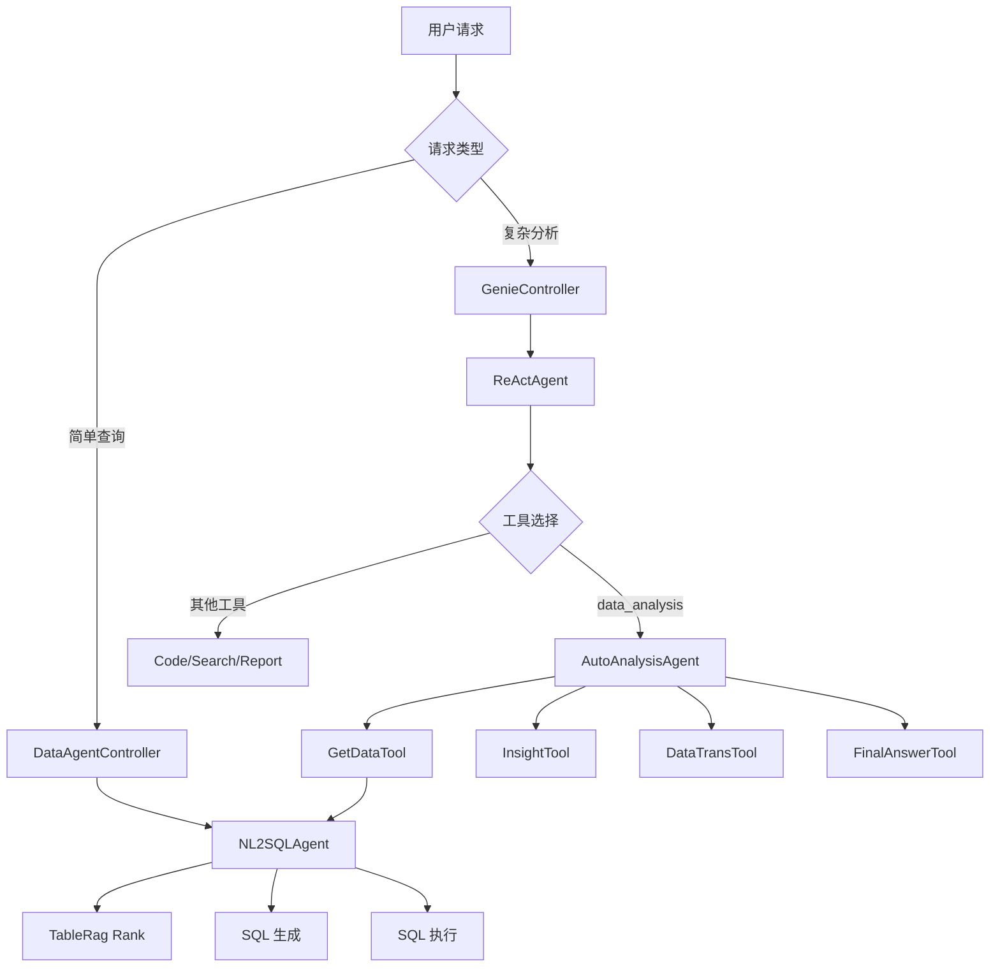

# NL2SQLAgent 技术文档

## 目录

1. [系统概述](#系统概述)
2. [整体架构](#整体架构)
3. [NL2SQLAgent 详细业务流程](#nl2sqlagent-详细业务流程)
4. [AutoAnalysisAgent 详解](#autoanalysisagent-详解)
5. [智能体切换机制](#智能体切换机制)
6. [关键数据结构](#关键数据结构)
7. [配置说明](#配置说明)
8. [API 接口文档](#api-接口文档)
9. [部署架构](#部署架构)
10. [最佳实践](#最佳实践)

---

## 系统概述

### 1.1 系统简介

Genie 数据分析智能体系统是一个基于大语言模型的 Text-to-SQL 和智能数据分析平台，支持用户通过自然语言进行数据查询和分析。

### 1.2 核心能力

- **自然语言转 SQL**：将用户自然语言转换为可执行的 SQL 查询
- **智能数据检索**：基于 TableRAG 技术进行 Schema 召回和优化
- **流式响应**：实时展示思考过程和中间结果
- **深度分析**：支持趋势分析、相关性分析、拐点检测等高级分析功能
- **多数据源支持**：支持 MySQL、ClickHouse 等多种数据库

### 1.3 技术栈

| 层级 | 技术栈 |
|------|--------|
| 后端框架 | Spring Boot + MyBatis Plus |
| 智能体框架 | SmolAgents (Python) |
| SQL 解析 | Apache Calcite |
| 数据库 | MySQL / ClickHouse |
| 向量检索 | Qdrant (可选) |
| 全文检索 | Elasticsearch (可选) |
| LLM | GPT-4.1 / Qwen3:4b (通过 Ollama) |

---

## 整体架构

### 2.1 系统分层架构

```
┌─────────────────────────────────────────────────────────────────┐
│                        用户交互层                                │
│  Web 前端 / API 客户端                                           │
└────────────────────────┬────────────────────────────────────────┘
                         │
                         ▼
┌─────────────────────────────────────────────────────────────────┐
│                        网关路由层                                │
│  ┌──────────────────┐      ┌──────────────────┐                  │
│  │ DataAgentController│      │ GenieController  │                  │
│  │  (专用数据分析)    │      │  (通用智能体)     │                  │
│  └────────┬─────────┘      └────────┬─────────┘                  │
└───────────┼─────────────────────────┼─────────────────────────────┘
            │                         │
            ▼                         ▼
┌───────────────────────┐    ┌─────────────────────────────────┐
│   NL2SQL 服务层       │    │      ReActAgent 框架            │
│  ┌─────────────────┐  │    │  ┌─────────────────────────────┐│
│  │ TableRagService │  │    │  │ 工具协调器                   ││
│  │ Nl2SqlService   │  │    │  │ - DataAnalysisTool          ││
│  │ DataAgentService│  │    │  │ - CodeInterpreterTool       ││
│  └─────────────────┘  │    │  │ - DeepSearchTool            ││
└───────────┼───────────┘    │  │ - ReportTool                ││
            │               │  └─────────────────────────────┘│
            ▼               └──────────────┬────────────────────┘
┌─────────────────────────────────────────────────────────────────┐
│                    Python 智能体层                               │
│  ┌────────────────────┐      ┌──────────────────────────────┐  │
│  │   NL2SQLAgent       │      │   AutoAnalysisAgent           │  │
│  │ - Rewrite          │      │ - GetDataTool (调用 NL2SQL)   │  │
│  │ - TableRag Rank    │      │ - InsightTool                 │  │
│  │ - Think            │      │ - DataTransTool               │  │
│  │ - NL2SQL Convert   │      │ - SaveInsightTool             │  │
│  └────────────────────┘      │ - FinalAnswerTool             │  │
│                              └──────────────────────────────┘  │
└───────────────────────────────────────────┬─────────────────────┘
                                            │
                         ┌──────────────────┴──────────────────┐
                         │                                     │
                         ▼                                     ▼
                  ┌─────────────┐                     ┌─────────────┐
                  │  SQL 执行   │                     │ Python 分析 │
                  │ JDBC Provider                     │ Pandas      │
                  └─────────────┘                     └─────────────┘
```

### 2.2 核心组件关系



---

## NL2SQLAgent 详细业务流程

### 3.1 完整执行流程

```
用户输入自然语言查询
        │
        ▼
┌─────────────────────────────────────────────────────────────┐
│  阶段 1：请求预处理与初始化                                  │
│  - 创建 SSE 连接                                             │
│  - 生成 requestId 和 traceId                                 │
│  - 构建基础 NL2SQLReq（包含所有模型信息）                    │
└────────────────────────┬────────────────────────────────────┘
                         │
                         ▼
┌─────────────────────────────────────────────────────────────┐
│  阶段 2：Schema 增强（TableRag 召回）                       │
│  1. TableRag 召回相关表的 Schema                             │
│     - 向量检索：基于 Qdrant                                  │
│     - 全文检索：基于 Elasticsearch                           │
│  2. 合并默认召回字段                                         │
│  3. 按 modelCode 分组并填充到各个模型                        │
└────────────────────────┬────────────────────────────────────┘
                         │
                         ▼
┌─────────────────────────────────────────────────────────────┐
│  阶段 3：Python NL2SQLAgent 处理（并发执行）                │
│  ┌───────────────────────────────────────────────────────┐ │
│  │ 任务 1：Query Rewrite（查询重写）                      │ │
│  │  - 目的：标准化用户查询，消除歧义                       │ │
│  │  - 输入：原始查询 + 业务规则 + 时间信息                │ │
│  │  - 输出：标准化后的查询                                 │ │
│  └───────────────────────────────────────────────────────┘ │
│                              │                              │
│  ┌───────────────────────────────────────────────────────┐ │
│  │ 任务 2：TableRag Rank（表/字段过滤）                   │ │
│  │  2.1 第一阶段：表过滤（粗筛）                          │ │
│  │      - 输入：所有表 + 用户查询                          │ │
│  │      - 输出：相关表的编号列表                          │ │
│  │  2.2 第二阶段：字段过滤（细筛）                        │ │
│  │      - 输入：每个表的全部字段                          │ │
│  │      - 输出：每个表的相关字段列表                      │ │
│  └───────────────────────────────────────────────────────┘ │
└────────────────────────┬────────────────────────────────────┘
                         │
                         ▼
┌─────────────────────────────────────────────────────────────┐
│  阶段 4：Schema 格式化                                       │
│  - 将过滤后的 Schema 转换为结构化文本                       │
│  - 包含：表名、字段ID、字段名、类型、描述、别名、示例值     │
│  - 添加业务规则、时间规则、使用规范                         │
└────────────────────────┬────────────────────────────────────┘
                         │
                         ▼
┌─────────────────────────────────────────────────────────────┐
│  阶段 5：Think（思考过程，流式输出）                        │
│  - 目的：生成分析思考过程，向用户展示                       │
│  - 流程：                                                   │
│    1. 拆解问题核心（识别指标、维度）                        │
│    2. 匹配字段信息（关联相关字段）                          │
│    3. 推导回答逻辑（说明分析步骤）                          │
│  - 输出方式：SSE 流式发送                                   │
└────────────────────────┬────────────────────────────────────┘
                         │
                         ▼
┌─────────────────────────────────────────────────────────────┐
│  阶段 6：NL2SQL Convert（SQL 生成）                         │
│  - 输入：重写后的查询 + 思考结果 + 格式化 Schema           │
│  - 输出格式：问题1###SQL1@@@问题2###SQL2                    │
│  - SQL 生成规范：                                           │
│    • 禁止使用 JOIN 多表关联                                 │
│    • 使用字段 ID 而非字段名                                 │
│    • 非统计类查询使用 DISTINCT                              │
│    • 聚合类查询添加别名                                     │
└────────────────────────┬────────────────────────────────────┘
                         │
                         ▼
┌─────────────────────────────────────────────────────────────┐
│  阶段 7：SQL 解析与执行                                     │
│  1. SQL 解析（Apache Calcite）                              │
│     - 提取列信息、过滤条件、排序规则                        │
│  2. 表名替换（处理 SQL 类型模型）                           │
│  3. JDBC 查询执行                                           │
│  4. 结果封装为 ChatQueryData                                │
└────────────────────────┬────────────────────────────────────┘
                         │
                         ▼
┌─────────────────────────────────────────────────────────────┐
│  阶段 8：结果处理与返回                                     │
│  1. 图表配置解析                                            │
│     - 区分维度列和度量列                                    │
│  2. 结果格式转换                                            │
│     - 字段名转小写                                          │
│  3. SSE 返回结果                                            │
└─────────────────────────────────────────────────────────────┘
```

### 3.2 关键代码路径

#### 3.2.1 Java 后端入口

```java
// DataAgentController.java
@PostMapping(value = "chatQuery", produces = MediaType.TEXT_EVENT_STREAM_VALUE)
public SseEmitter chatQuery(@RequestBody DataAgentChatReq req) throws Exception {
    return dataAgentService.webChatQueryData(req);
}

// DataAgentService.java
public SseEmitter webChatQueryData(DataAgentChatReq req) throws Exception {
    SseEmitter emitter = new SseEmitter(AUTO_AGENT_SSE_TIMEOUT);
    NL2SQLReq baseNl2SqlReq = getBaseNl2SqlReq(req.getContent());
    enrichNl2Sql(baseNl2SqlReq);  // Schema 增强
    
    ThreadUtil.execute(() -> {
        List<ChatQueryData> result = nl2SqlService.runNL2SQLSse(baseNl2SqlReq, emitter);
        emitter.send(ChatDataMessage.ofData(result));
    });
    
    return emitter;
}
```

#### 3.2.2 Python NL2SQLAgent 核心

```python
# nl2sql.py
async def run(self, body: NL2SQLRequest, **kwargs):
    # 并发执行 Rank 和 Rewrite
    rank_task = asyncio.create_task(rank_module.batch_get_result())
    rewrite_task = asyncio.create_task(self._text_to_rewrite(...))
    
    rewritten_query, rank_result = await asyncio.gather(rewrite_task, rank_task)
    
    # 格式化 Schema
    m_schema_formatted = await self.m_schema_format(rank_result)
    
    # 流式输出 Think
    full_thinking = await self._collect_think_results(...)
    
    # 生成 SQL
    nl2sql_response = await self._nl2sql_convert(...)
    
    return nl2sql_response
```

### 3.3 TableRag Rank 两阶段过滤详解

#### 3.3.1 第一阶段：表过滤

```python
# table_column_filter.py
async def filter_table(self, semaphore, schema_info_list):
    # 生成 Prompt
    prompt = Template(table_rag_prompts["table_filter_prompt"]).render(
        model_code_list=[1, 2, 3],
        table_info=table_info,  # 表名、描述、部分字段
        query=query
    )
    
    # 调用 LLM
    llm_response = await ask_llm(messages=[...], model=...)
    
    # 解析返回的表编号列表
    model_code_index_list = read_json(llm_response)  # [1, 2]
    schema_info_list = [index2model_code_map[i] for i in model_code_index_list]
    
    return schema_info_list
```

**Prompt 示例**：
```
# 角色
你是一名精准的数据表匹配专家

# 任务
根据用户问题和数据表元信息，识别并输出与问题相关的数据表编号列表

# 数据表信息
<编号>：1 <编号>
<表名>：超市销售明细数据<表名>
<表描述>：包含商品采购日期，商品类型等信息<表描述>
<表的相关字段>：
字段名：order_date - 描述：订单日期
字段名：sales - 描述：销售额
...

<编号>：2 <编号>
<表名>：商品采购信息<表名>
...

# 用户问题
查询销售额排名前10的商品

# 输出
[1]  # 仅输出 JSON 格式的表编号列表
```

#### 3.3.2 第二阶段：字段过滤

```python
async def _filter_single_table(self, semaphore, table_schema_info):
    # 生成字段过滤 Prompt
    prompt = Template(table_rag_prompts["column_filter_prompt"]).render(
        table_info=table_schema_info,  # 包含所有字段
        query=query
    )
    
    # 调用 LLM
    llm_response = await ask_llm(messages=[...], model=...)
    
    # 解析结果
    result_dict = json.loads(llm_response)
    
    if result_dict["relatedFlag"] == "true":
        # 提取相关字段
        result_column_indexes = result_dict["columnIndexes"]
        filter_columns = [col for col in columns 
                         if col.get("columnIndex") in result_column_indexes 
                         or col.get("defaultRecall") == 1]
        table_schema_info["schemaList"] = filter_columns
    
    return table_schema_info
```

**Prompt 示例**：
```
# 角色
你是一名专业的数据表字段选择大师

# 核心要求
1. 用户输入问题中包含的所有关键字都需要考虑
2. 数据表中的业务规则强制要求的字段，必须确保出现在输出结果中
3. 筛选策略严禁遗漏任何相关字段

# 数据表信息
{
  "tableName": "超市销售明细数据",
  "columns": [
    {"columnIndex": 1, "columnName": "order_date", "columnComment": "订单日期"},
    {"columnIndex": 2, "columnName": "sales", "columnComment": "销售额"},
    {"columnIndex": 3, "columnName": "product_name", "columnComment": "商品名称"}
  ]
}

# 用户问题
查询销售额排名前10的商品

# 输出
```json
{
  "relatedFlag": true,
  "columnIndexes": [2, 3]  # sales, product_name
}
```
```

### 3.4 Prompt 模板详解

#### 3.4.1 Rewrite Prompt

```yaml
# 角色
您是一名资深的数据分析专家，负责将用户问题补充完善为完整无歧义的问题

# 要求
1. 如果用户问题中有涉及到业务规则，将用户问题根据业务规则改写
2. 如果有时间约束条件，请根据时间约束提供标准的时间
3. **严格禁止修改用户问题的语义**

# 业务规则
{{business_info}}

# 时间约束
{{time_info}}

# 用户问题
{{query}}
```

**示例**：
```
输入：我的销售额
输出：2023年全年销售额
```

#### 3.4.2 Think Prompt

```yaml
# 角色
你是一名专注于「业务数据解读」的资深分析师

# 任务流程
1）拆解问题核心
明确用户问题涉及的核心业务指标、分析维度或业务关系

2）匹配字段信息
从「数据源信息」中筛选与问题直接相关的字段

3）推导回答逻辑
说明字段间如何关联、通过哪些分析步骤可支撑问题解答

# 严格禁止
1. 绝对禁止出现任何暗示信息不足的表述
2. 禁止使用任何结论性语句

# 数据源信息
{{m_schema_formatted}}

# 用户问题
{{query}}
```

**示例输出**：
```
1. 用户问题核心是查询销售额，属于聚合统计类需求，需要关注销售额这一指标

2. 从数据源信息中，sales字段为销售额指标，order_date字段可作为时间维度，product_name可作为商品维度

3. 回答逻辑需要先按商品名称分组，然后对销售额进行聚合计算，最后按销售额降序排序得到排名
```

#### 3.4.3 NL2SQL Prompt

```yaml
# 角色
你是一个高级、精确的 SQL 查询生成器

# 任务流程
1. 用户问题拆解
   - 将用户问题分解为独立且无歧义的子问题
   - 拆解结果用 @@@ 分隔
   
2. 表和字段的召回
   - 充分参考【思考伪代码】中的信息
   - 禁止臆想不存在的字段
   
3. 生成 SQL
   - 基于用户拆解的问题和召回的数据表、字段生成 SQL

# 输出格式
问题1###sql1@@@问题2###sql2

# 思考伪代码
{{thinking_result}}

# 表信息以及相关字段信息
{{m_schema_formatted}}

# 用户问题
{{query}}
```

**示例输出**：
```
查询销售额排名前10的商品###SELECT DISTINCT `product_name`, SUM(`sales`) AS `total_sales` FROM `sales_data` GROUP BY `product_name` ORDER BY `total_sales` DESC LIMIT 10
```

---

## AutoAnalysisAgent 详解

### 4.1 概述

AutoAnalysisAgent 是一个高级数据分析智能体，专门处理复杂的数据分析任务。它内部使用 NL2SQLAgent 作为数据获取工具，然后进行多维度的统计分析。

### 4.2 核心能力

| 工具 | 功能描述 |
|------|---------|
| **GetDataTool** | 智能取数工具（内部调用 NL2SQL） |
| **InsightTool** | 数据分析工具（7种分析方法） |
| **DataTransTool** | 数据变换工具（4种变换类型） |
| **SaveInsightTool** | 保存分析结论 |
| **FinalAnswerTool** | 生成最终答案 |

### 4.3 支持的分析方法

#### 4.3.1 InsightTool 方法列表

```python
class InsightTool(Tool):
    """数据分析工具 - 支持7种分析方法"""
    
    # - OutstandingFirst: 分析指标表现最高的情况
    # - OutstandingLast: 分析指标表现最差的情况
    # - Attribution: 归因分析（最高值是否占据主导地位）
    # - Evenness: 均匀性分析
    # - Trend: 趋势分析（需要时序数据）
    # - Correlation: 相关性分析（需要数字维度）
    # - ChangePoint: 拐点检测（需要时序数据）
```

#### 4.3.2 DataTransTool 变换类型

```python
class DataTransTool(Tool):
    """数据变换工具"""
    
    # - rate: 计算占比
    # - rank: 计算排名
    # - increase: 计算增长（需要时序）
    # - sub_avg: 计算与均值差值
```

### 4.4 典型分析流程

#### 场景：分析最近一年销售趋势并找出异常

```python
# 用户任务
task = "分析最近一年销售趋势，找出异常波动的原因"

# Agent 执行步骤

# 步骤 1：取数
get_data(
    query="根据订单月份进行分组，统计最近12个月的销售额"
)
# → 内部调用 NL2SQLAgent
# → 生成 SQL: SELECT month, SUM(sales) FROM ... GROUP BY month
# → 返回 DataFrame

# 步骤 2：趋势分析
insight_analysis(
    df=sales_df,
    breakdown="订单月份",
    measure="销售额",
    analysis_method="Trend"
)
# → 分析销售额的时间趋势
# → 输出："销售额整体呈上升趋势，增长率约为..."

# 步骤 3：拐点检测
insight_analysis(
    df=sales_df,
    breakdown="订单月份",
    measure="销售额",
    analysis_method="ChangePoint"
)
# → 检测数据中的转折点
# → 输出："在2023年6月出现拐点，增长率达到峰值"

# 步骤 4：计算增长率
data_trans(
    df=sales_df,
    column="订单月份",
    measure="销售额",
    trans_type="increase"
)
# → 计算环比增长
# → 返回包含增长率的新 DataFrame

# 步骤 5：保存结论
save_insight(
    df=result_df,
    insight="销售额在2023年6月出现拐点，增长率达到峰值25%，可能与促销活动相关",
    analysis_process="趋势分析 + 拐点检测 + 增长率计算"
)

# 步骤 6：生成最终答案
final_answer(
    answer="""## 分析结论

### 趋势分析
最近一年销售额整体呈上升趋势...

### 异常波动
- 2023年6月：增长率达到峰值25%
- 2023年11月：出现异常下降

### 建议措施
..."""
)
```

### 4.5 与 NL2SQLAgent 的集成

AutoAnalysisAgent 通过 `GetDataTool` 调用 NL2SQLAgent：

```python
class GetDataTool(Tool):
    """智能取数工具 - 内部调用 NL2SQL"""
    
    def forward(self, query: str) -> pd.DataFrame:
        # 调用 Java 后端的 DataAgentController
        base_datas = get_data(
            query=query,
            modelCodeList=self.context.modelCodeList,
            request_id=self.context.request_id
        )
        
        # 合并多个查询结果
        df = self.merge_df(base_datas)
        
        # 输出 SQL 和数据预览
        self.context.queue.put({
            "data": f"\n### 取数 SQL\n```sql\n{sql}\n```\n"
        })
        self.context.queue.put({
            "data": f"\n### 取数结果\n共获取 {len(df)} 条数据\n{df.head().to_markdown()}"
        })
        
        return df
```

---

## 智能体切换机制

### 5.1 路由决策树

```
用户请求
    │
    ▼
┌─────────────────────────────────────────┐
│  判断：使用哪个接口？                    │
└────────────────┬────────────────────────┘
                 │
        ┌────────┴────────┐
        │                 │
        ▼                 ▼
┌──────────────┐  ┌──────────────┐
│ /data/       │  │ /AutoAgent   │
│ chatQuery    │  │              │
└──────┬───────┘  └──────┬───────┘
       │                 │
       ▼                 ▼
 直接使用          判断 outputStyle
 NL2SQLAgent         │
                     ┌──┴──┐
                     │     │
                     ▼     ▼
              dataAgent  其他
                     │     │
                     ▼     ▼
           DataAnalysisTool  通用工具
                     │     (search/
                     ▼      code/
            ReActAgent    report)
              决策使用
              哪个工具
```

### 5.2 路由规则详解

#### 规则 1：接口级别路由

| 接口 | 智能体 | 使用场景 |
|------|--------|---------|
| `POST /data/chatQuery` | NL2SQLAgent | 简单数据查询 |
| `POST /data/apiChatQuery` | NL2SQLAgent | API 形式的数据查询 |
| `POST /AutoAgent` | ReActAgent | 复杂任务执行 |

#### 规则 2：outputStyle 参数路由

| outputStyle 值 | 可用工具 | 智能体类型 |
|----------------|---------|-----------|
| `dataAgent` | ReportTool, DataAnalysisTool | 数据分析模式 |
| `html` | FileTool, CodeInterpreterTool, ReportTool | 网页生成模式 |
| `docs` | FileTool, CodeInterpreterTool, ReportTool | 文档生成模式 |
| `table` | FileTool, CodeInterpreterTool | 表格生成模式 |
| 其他（默认） | search, code, report | 通用模式 |

#### 规则 3：工具级别决策

```python
# ReActAgent 的决策逻辑（LLM 自动选择）

用户任务：分析最近一年销售趋势

ReActAgent 思考过程：
1. 这是一个数据分析任务
2. 可用工具：search, code, data_analysis
3. data_analysis 工具最适合此任务

决策：调用 data_analysis 工具
→ 触发 AutoAnalysisAgent
→ AutoAnalysisAgent 内部调用 NL2SQLAgent
```

### 5.3 代码实现

#### 5.3.1 GenieController 路由逻辑

```java
@PostMapping("/AutoAgent")
public SseEmitter AutoAgent(@RequestBody AgentRequest request) {
    // 构建 AgentContext
    AgentContext agentContext = AgentContext.builder()
        .templateType("dataAgent".equals(request.getOutputStyle()) ? "fix" : "empty")
        .build();
    
    // 构建工具列表（关键路由点）
    agentContext.setToolCollection(buildToolCollection(agentContext, request));
    
    // 获取对应的 Handler
    AgentHandlerService handler = agentHandlerFactory.getHandler(agentContext, request);
    
    // 执行处理逻辑
    handler.handle(agentContext, request);
    
    return emitter;
}
```

#### 5.3.2 工具列表构建

```java
private ToolCollection buildToolCollection(AgentContext agentContext, AgentRequest request) {
    ToolCollection toolCollection = new ToolCollection();
    
    // dataAgent 模式
    if ("dataAgent".equals(request.getOutputStyle())) {
        // 添加数据分析专用工具
        toolCollection.addTool(new ReportTool());
        toolCollection.addTool(new DataAnalysisTool());
    } else {
        // 默认模式
        String toolList = genieConfig.getMultiAgentToolListMap()
            .getOrDefault("default", "search,code,report");
        
        for (String tool : toolList.split(",")) {
            switch (tool) {
                case "data_analysis":
                    toolCollection.addTool(new DataAnalysisTool());
                    break;
                case "search":
                    toolCollection.addTool(new DeepSearchTool());
                    break;
                // ... 其他工具
            }
        }
    }
    
    return toolCollection;
}
```

#### 5.3.3 Handler 选择

```java
@Component
public class AgentHandlerFactory {
    
    public AgentHandlerService getHandler(AgentContext context, AgentRequest request) {
        // 遍历所有 Handler，找到支持的
        for (AgentHandlerService handler : handlerMap.values()) {
            if (handler.support(context, request)) {
                return handler;
            }
        }
        return null;
    }
}

// ReactHandlerImpl
@Component
public class ReactHandlerImpl implements AgentHandlerService {
    
    @Override
    public Boolean support(AgentContext agentContext, AgentRequest request) {
        // 支持 agentType = 1 (REACT) 的请求
        return AgentType.REACT.getValue().equals(request.getAgentType());
    }
}
```

---

## 关键数据结构

### 6.1 请求数据结构

#### 6.1.1 NL2SQLReq

```java
public class NL2SQLReq {
    private String requestId;              // 请求唯一标识
    private String query;                  // 自然语言查询
    private List<String> modelCodeList;    // 模型码列表
    private List<ChatModelInfoDto> schemaInfo;  // Schema 信息
    private String currentDateInfo;        // 当前时间信息
    private String traceId;                // 追踪 ID
    private String recallType;             // 召回类型
    private Boolean stream;                // 是否流式
    private String userInfo;               // 用户信息
    private String dbType;                 // 数据库类型
    private boolean useVector;             // 是否使用向量
    private boolean useElastic;            // 是否使用 ES
}
```

#### 6.1.2 ChatModelInfoDto

```java
public class ChatModelInfoDto {
    private String modelCode;              // 模型编码
    private String modelName;              // 模型名称
    private String businessPrompt;         // 业务规则
    private String usePrompt;              // 使用规范
    private String type;                   // 类型：table/sql
    private String content;                // 表内容或 SQL
    private List<ChatSchemaDto> schemaList; // 字段列表
}
```

#### 6.1.3 ChatSchemaDto

```java
public class ChatSchemaDto {
    private String modelCode;              // 所属模型
    private String columnId;               // 字段 ID
    private String columnName;             // 字段名称
    private String columnComment;          // 字段描述
    private String fewShot;                // 示例值
    private String dataType;               // 数据类型
    private String synonyms;               // 别名
    private String vectorUuid;             // 向量 ID
    private int defaultRecall;             // 默认召回标记
    private int analyzeSuggest;            // 分析建议标记
}
```

#### 6.1.4 NL2SQLResult

```java
public class NL2SQLResult {
    private Integer code;                  // 响应码
    private String request_id;             // 请求 ID
    private String nl2sql_think;           // 思考过程
    private String status;                 // 状态
    private List<NL2SQLData> data;         // SQL 结果列表
    private String err_msg;                // 错误信息
    private String rootQuery;              // 原始查询
    private Map<String, Object> cost_time; // 耗时统计
    
    public static class NL2SQLData {
        private String query;              // 子问题
        private String nl2sql;             // 生成的 SQL
    }
}
```

#### 6.1.5 ChatQueryData

```java
public class ChatQueryData {
    private String question;               // 问题
    private List<Map<String, Object>> dataList;  // 数据列表
    private List<ChatQueryColumn> columnList;    // 列信息
    private List<ChatQueryFilter> filters;       // 过滤条件
    private List<String> dimCols;         // 维度列
    private List<String> measureCols;     // 度量列
    private String nl2sqlResult;          // NL2SQL 结果
    private String modelName;             // 模型名称
}
```

### 6.2 响应数据结构

#### 6.2.1 SSE 事件格式

```json
// 思考过程事件
{
  "code": 200,
  "status": "nl2sql_think",
  "nl2sql_think": "1. 用户问题核心是查询销售额...",
  "request_id": "xxx"
}

// 流结束事件
{
  "code": 200,
  "status": "finished_stream",
  "request_id": "xxx"
}

// 数据事件
{
  "code": 200,
  "status": "data",
  "data": [
    {
      "query": "查询销售额排名前10的商品",
      "nl2sql": "SELECT `product_name`, SUM(`sales`)..."
    }
  ],
  "request_id": "xxx"
}

// 最终完成事件
{
  "code": 200,
  "status": "finished",
  "request_id": "xxx"
}
```

---

## 配置说明

### 7.1 核心配置文件

位置：`genie-backend/src/main/resources/application.yml`

```yaml
autobots:
  autoagent:
    planner:
      system_prompt: '{}'          # 规划智能体 Prompt
      model_name: 'ollama/qwen3:4b'
      
    executor:
      system_prompt: '{}'          # 执行智能体 Prompt
      model_name: 'ollama/qwen3:4b'
      
    react:
      system_prompt: '{}'          # ReAct 智能体 Prompt
      model_name: 'ollama/qwen3:4b'
      
    summary:
      system_prompt: '{}'          # 总结智能体 Prompt
      
    tool:
      plan_tool:                   # 规划工具配置
        params: '{}'
        
      data_analysis_url: "http://127.0.0.1:1601"  # 数据分析服务地址
      
  data-agent:
    agent-url: "http://127.0.0.1:1601"           # Agent 服务地址
    db-config:
      type: mysql
      host: 127.0.0.1
      port: 3306
      schema: agent_report
      username: root
      password: password
      
    es-config:
      enable: false                  # 是否启用 ES
      host: 127.0.0.1
      port: 40000
      
    qdrantConfig:
      enable: false                  # 是否启用 Qdrant
      host: 127.0.0.1
      port: 6333
      
    model-list:                      # 数据模型列表
      - name: "超市销售明细数据"
        id: "sales_data"
        type: "table"
        content: "sales_data"
        business-prompt: "order_date为日维度数据，如果统计月份要使用FORMATDATETIME(`order_date`, 'yyyy-MM')"
        column-alias-map: '{"order_date":"销售日期,下单日期"}'
```

### 7.2 环境变量

位置：`genie-tool/.env`

```bash
# LLM 配置
NL2SQL_MODEL_NAME=gpt-4.1
REWRITE_MODEL_NAME=gpt-4.1
THINK_MODEL_NAME=gpt-4.1
CODE_INTEPRETER_MODEL=gpt-4.1
ANALYSIS_MODEL=gpt-4.1

# API 地址
ANA_SCHEMA_URL=http://127.0.0.1:8080/data/queryModelInfo
ANA_DATA_URL=http://127.0.0.1:8080/data/apiChatQuery

# TableRag 配置
TR_TABLE_FILTER_MODEL_NAME=gpt-4.1
TR_COLUMN_FILTER_MODEL_NAME=gpt-4.1
TR_IS_FIRST_FILTER_TABLE=true
TR_NEED_FILTER_TABLE_MIN_LENGTH=3
TR_SCHEMA_LIST_MAX_LENGTH=200
```

---

## API 接口文档

### 8.1 数据分析接口

#### 8.1.1 SSE 流式查询

```http
POST /data/chatQuery
Content-Type: application/json

{
  "content": "查询销售额排名前10的商品"
}

Response: (SSE 流)
data: {"code":200,"status":"nl2sql_think","nl2sql_think":"1. 用户问题核心是...","request_id":"xxx"}

data: {"code":200,"status":"finished_stream","request_id":"xxx"}

data: {"code":200,"status":"data","data":[{"question":"...","dataList":[...],"columnList":[...]}],"request_id":"xxx"}
```

#### 8.1.2 API 同步查询

```http
POST /data/apiChatQuery
Content-Type: application/json

{
  "content": "查询各地区的销售总额"
}

Response:
{
  "code": 200,
  "data": [
    {
      "question": "查询各地区的销售总额",
      "dataList": [
        {"region": "华东", "total_sales": 100000},
        {"region": "华南", "total_sales": 80000}
      ],
      "columnList": [...],
      "dimCols": ["region"],
      "measureCols": ["total_sales"]
    }
  ]
}
```

### 8.2 通用智能体接口

#### 8.2.1 AutoAgent 接口

```http
POST /AutoAgent
Content-Type: application/json

{
  "requestId": "uuid",
  "query": "分析最近一年销售趋势并找出异常",
  "outputStyle": "dataAgent",
  "agentType": 1,
  "isStream": true
}

Response: (SSE 流)
data: {"message_id":"xxx","type":"tool_result","tool_result":{"type":"data_analysis","task":"..."}}

data: {"requestId":"xxx","data":"\n# 分析任务\n分析最近一年销售趋势\n","isFinal":false}

data: {"requestId":"xxx","data":"\n## 分析步骤 1\n","isFinal":false}

data: {"requestId":"xxx","data":"\n### 1. 取数 Query\n根据月份分组统计最近12个月销售额\n","isFinal":false}

data: {"requestId":"xxx","data":"\n### 2. 取数 SQL\n```sql\nSELECT month, SUM(sales)...```\n","isFinal":false}

data: {"requestId":"xxx","fileInfo":[...],"data":"\n## 分析结论\n...","isFinal":true}
```

---

## 部署架构

### 9.1 部署拓扑

```
┌─────────────────────────────────────────────────────────────┐
│                        负载均衡层                            │
│                       Nginx / SLB                           │
└────────────────────┬────────────────────────────────────────┘
                     │
        ┌────────────┴────────────┐
        │                         │
        ▼                         ▼
┌──────────────┐          ┌──────────────┐
│ Java Backend │          │ Python Agent │
│  (Spring Boot)│         │   (FastAPI)   │
│  Port: 8080   │          │  Port: 1601   │
└──────┬───────┘          └──────┬───────┘
       │                         │
       ▼                         ▼
┌──────────────┐          ┌──────────────┐
│   MySQL      │          │   Qdrant     │
│  Port: 3306  │          │  Port: 6333  │
└──────────────┘          └──────────────┘
```

### 9.2 Docker Compose 部署

```yaml
version: '3.8'

services:
  # Java 后端
  genie-backend:
    build: ./genie-backend
    ports:
      - "8080:8080"
    environment:
      - SPRING_DATASOURCE_URL=jdbc:mysql://mysql:3306/agent_report
      - AUTOBOTS_DATA-AGENT_AGENT-URL=http://genie-tool:1601
    depends_on:
      - mysql
      - genie-tool

  # Python Agent
  genie-tool:
    build: ./genie-tool
    ports:
      - "1601:1601"
    environment:
      - OPENAI_API_KEY=sk-xxx
      - OPENAI_BASE_URL=http://ollama:11434/v1
    depends_on:
      - qdrant

  # MySQL
  mysql:
    image: mysql:8.0
    ports:
      - "3306:3306"
    environment:
      - MYSQL_ROOT_PASSWORD=password
      - MYSQL_DATABASE=agent_report

  # Qdrant 向量数据库
  qdrant:
    image: qdrant/qdrant:latest
    ports:
      - "6333:6333"
    volumes:
      - qdrant_data:/qdrant/storage

  # Ollama LLM
  ollama:
    image: ollama/ollama:latest
    ports:
      - "11434:11434"
    volumes:
      - ollama_data:/root/.ollama

volumes:
  qdrant_data:
  ollama_data:
```

---

## 最佳实践

### 10.1 模型设计最佳实践

#### 10.1.1 业务规则配置

```yaml
# 好的做法：提供详细的业务规则
business-prompt: |
  order_date为日维度数据，如果统计月份要使用FORMATDATETIME(`order_date`, 'yyyy-MM')
  sales_amount单位为元，需要除以10000转换为万元
  customer_type: 1=新客户, 2=老客户

# 避免的做法：业务规则不清晰
business-prompt: "日期字段需要注意"
```

#### 10.1.2 字段别名配置

```yaml
# 好的做法：提供丰富的别名
column-alias-map: '{"order_date":"销售日期,下单日期,订单日期,日期"}'

# 好的做法：提供准确的示例值
fewShot: "2023-01-15, 2023-02-20, 2023-03-10"
```

### 10.2 Prompt 优化建议

#### 10.2.1 Rewrite Prompt

```yaml
# 包含具体的业务规则
business_info: |
  - 销售额统计需要排除退货订单
  - 时间范围默认为最近一年
  - 地区字段需要关联大区信息
```

#### 10.2.2 Think Prompt

```yaml
# 明确分析步骤
# 第一步：识别时间维度
# 第二步：确定统计指标
# 第三步：选择聚合方式
```

### 10.3 性能优化建议

#### 10.3.1 TableRag 优化

```python
# 调整批次大小
table_filter_batch_size = 5  # 根据并发能力调整

# 调整 Schema 长度限制
schema_list_max_length = 200  # 减少 Prompt 长度

# 启用请求延迟
api_request_delay = 0.5  # 避免速率限制
```

#### 10.3.2 并发优化

```python
# 并发执行 Rewrite 和 Rank
rewritten_query, rank_result = await asyncio.gather(
    rewrite_task, 
    rank_task
)
```

### 10.4 错误处理

#### 10.4.1 降级策略

```java
// TableRag 失败时降级到全 Schema
if (CollectionUtils.isEmpty(recallSchema)) {
    log.warn("召回schema为空，读取数据库");
    recallSchema = chatModelSchemaService.list();
}

// 合并默认召回字段
mergeSchema(recallSchema, defaultRecallSchema);
```

#### 10.4.2 重试机制

```python
# Python Agent 重试逻辑
for retry in range(3):
    try:
        result = await ask_llm(...)
        break
    except Exception as e:
        if retry == 2:
            raise RuntimeError(f"多次重试后执行失败: {e}")
        await asyncio.sleep((2 ** retry) * api_request_delay)
```

---

## 附录

### A. 术语表

| 术语 | 说明 |
|------|------|
| NL2SQL | Natural Language to SQL，自然语言转 SQL |
| TableRag | Table Retrieval Augmented Generation，表检索增强生成 |
| SSE | Server-Sent Events，服务器推送事件 |
| Schema | 数据库模式，包含表结构、字段信息 |
| FewShot | 少样本学习，提供示例值帮助理解 |
| Vector | 向量检索，基于语义相似度召回 |
| ReAct | Reasoning + Acting，推理与行动框架 |

### B. 错误码

| 错误码 | 说明 | 处理建议 |
|--------|------|---------|
| 200 | 成功 | - |
| 6001 | NL2SQL 执行失败 | 检查查询语句和 Schema 配置 |
| 6002 | TableRag 召回失败 | 检查向量/ES 配置，会自动降级 |
| 6003 | SQL 解析失败 | 检查生成的 SQL 语法 |

### C. 版本历史

| 版本 | 日期 | 说明 |
|------|------|------|
| 1.0.0 | 2024-05 | 初始版本 |
| 1.1.0 | 2024-08 | 新增 AutoAnalysisAgent |
| 1.2.0 | 2024-11 | 优化 TableRag 性能 |

---

**文档版本**：1.0.0  
**最后更新**：2026-05-20  
**维护团队**：Genie 数据智能体团队
